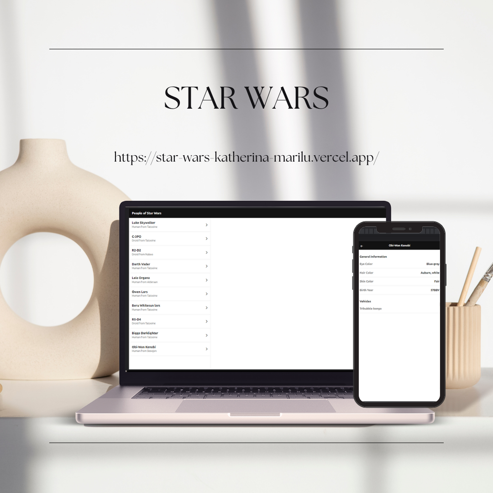

# Star Wars

## Índice

- [Resumen del proyecto](#1-resumen-del-proyecto)
- [Tecnologías](#2-tecnologías)
- [Recursos](#3-recursos)
- [Contacto](#4-contacto)

## 1. Resumen del proyecto

Bienvenido(a) al emocionante proyecto que marca mi primera incursión en el mundo de React, ya que esta librería solo la conocía en términos teóricos porque mayormente he trabajado con el framework de Angular, a su vez me resulto emocionante y retador realizar esta aplicación.

En este desafío, he creado una aplicación que consume la API de Star Wars y utiliza la potencia de React para organizar y mostrar la información de manera atractiva y funcional.

### Objetivo

Mi objetivo en este proyecto era familiarizarme con el entorno de desarrollo de React y poner en práctica el conocimiento teórico, comprender los conceptos básicos de construcción de componentes, y aprender cómo interactuar con una API externa para obtener y presentar datos en mi aplicación.

### Características Destacadas

- Consumo de API de Star Wars: A pesar de ser mi primera vez trabajando con React, logré implementar la lógica para hacer solicitudes a la API de Star Wars y recuperar datos esenciales como personajes, películas y naves espaciales.

- Paginación Eficiente: Una parte crucial del desafío fue implementar la paginación para manejar grandes conjuntos de datos de manera eficiente. A través de este proyecto, pude aprender y aplicar cómo dividir y presentar los datos en páginas que los usuarios puedan explorar sin problemas.

- Interfaz de Usuario Amigable y Responsive: Una característica que me enorgullece especialmente es que, diseñé la aplicación para que sea completamente responsive. Esto significa que los usuarios pueden acceder y explorar la aplicación de manera cómoda desde diferentes dispositivos, como teléfonos móviles (en particular para vistas móviles he usado ruteado en React), tablets y computadoras de escritorio.

### Agradecimientos

Quiero expresar mi agradecimiento por la oportunidad que este desafío me brindó. Estoy emocionada por lo que he logrado y ansiosa por seguir desarrollando mis habilidades en el mundo del desarrollo web.

¡Espero que disfruten explorando mi proyecto tanto como yo disfruté construyéndolo!

## 2. Tecnologías

- React: Biblioteca de JavaScript para la construcción de interfaces de usuario.
- Prop-types
- React-infinite-scroll-component
- React-router-dom

## 3. Recursos

API de Star Wars:
https://swapi.dev/

## 4. Contacto

- **e-mail**: katherinacornelio@gmail.com
- **LinkedIn**: https://www.linkedin.com/in/maricornelio/
- **Portfolio**: https://maricornelio.vercel.app/
